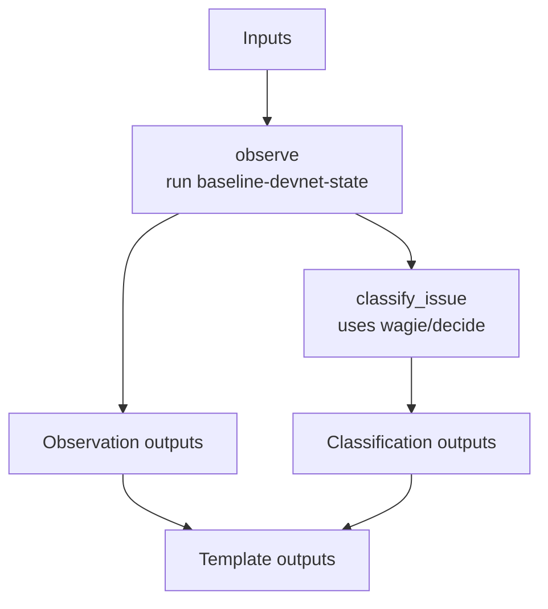

# ethpandaops/devnet-baseline

## Purpose

Builds the first health assessment for a devnet. It checks fork state, participation, missed slots, node sync, and validator activity, then classifies the most likely issue type and decides whether downstream finality analysis is required.

## Key Inputs

- `problem_statement`, `focus`
- `network_name`, `investigation_timeframe`
- `instances`
- `data_profile`
- `context_summary`
- `notes_summary`, `notes_highlights`, `notes_assumptions`

## Key Outputs

- `suspected_issue_type`, `issue_type_confidence`, `issue_type_reasoning`
- `baseline_summary`, `baseline_evidence`
- `affected_instances`, `instance_reports`
- `fork_data`, `validator_activity`, `epoch_snapshots`, `node_sync_status`
- `has_finality_issues`

## Flow

## Notes

- `observe` sets `has_finality_issues`, which is the key branch signal for `devnet-debug`.
- A detected split counts as a finality issue for routing purposes, even if the user described the problem differently.
