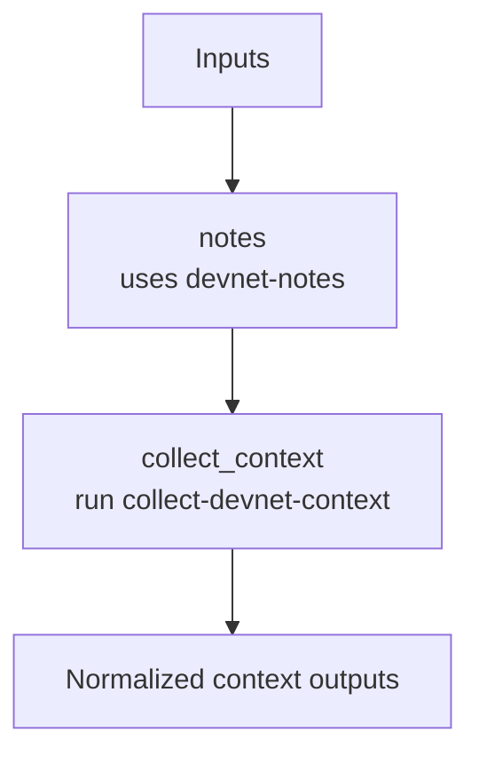

# ethpandaops/devnet-context

## Purpose

Normalizes the target devnet before deeper debugging starts. It resolves notes, identifies the network and deployment mode, discovers available observability surfaces, enumerates likely instances, and produces a concise context summary.

## Key Inputs

- `network`: target network or enclave name
- `timeframe`: requested investigation window
- `include_ci_surfaces`: whether to include CI-adjacent observability hints
- `notes_url`: optional explicit notes URL override

## Key Outputs

- `network_name`, `network_group`
- `investigation_timeframe`
- `clusters`, `instances`
- `data_profile`
- `summary`
- `notes_url`, `notes_summary`, `notes_highlights`, `notes_assumptions`

## Flow

## Notes

- `collect_context` is responsible for choosing remote ethpandaops mode vs local Kurtosis mode.
- `data_profile` is the main capability contract for downstream templates, including the resolved `loki_datasource` name when Loki is available.
- Notes assumptions are passed into context collection so caveats can survive into the normalized summary.
