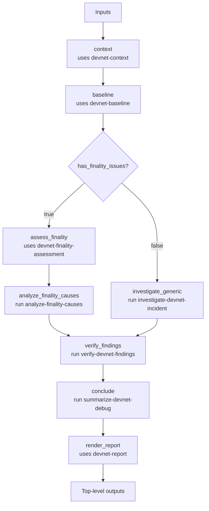

# ethpandaops/devnet-debug

## Purpose

Top-level devnet debugging workflow. It normalizes context, builds a baseline, chooses either a finality-specific or generic investigation path, verifies the resulting claims, and emits an operator-ready summary.

## Key Inputs

- `network`: target devnet or network name
- `problem_statement`: reported symptom or debugging goal
- `timeframe`: requested investigation window
- `focus`: optional debugging focus
- `suspected_instances`: optional list of instances to prioritize in baseline

## Key Outputs

- `issue_type`, `issue_type_confidence`, `issue_type_reasoning`
- `baseline_summary`, `baseline_evidence`
- `affected_instances`, `node_sync_status`
- `has_finality_issues`, `finality_status`, `finality_status_confidence`, `finality_status_reasoning`
- `findings_summary`, `root_cause`, `evidence`
- `instance_reports`, `log_examples`, `recommended_actions`
- `severity`, `summary`, `report`

## Flow

## Notes

- The branch decision is controlled by `baseline.outputs.has_finality_issues`.
- `suspected_instances` narrows the baseline and finality-assessment instance set, but the generic investigation path still works from baseline-derived findings rather than the raw hint.
- On the finality branch, `root_cause` and top-level `evidence` now both come from `analyze_finality_causes`.
- Loki queries should use the `loki_datasource` discovered during context collection rather than assuming a fixed datasource name.
- `devnet-report` now sits after the main conclusion step as a shareable rendering pass over the debug outputs.
