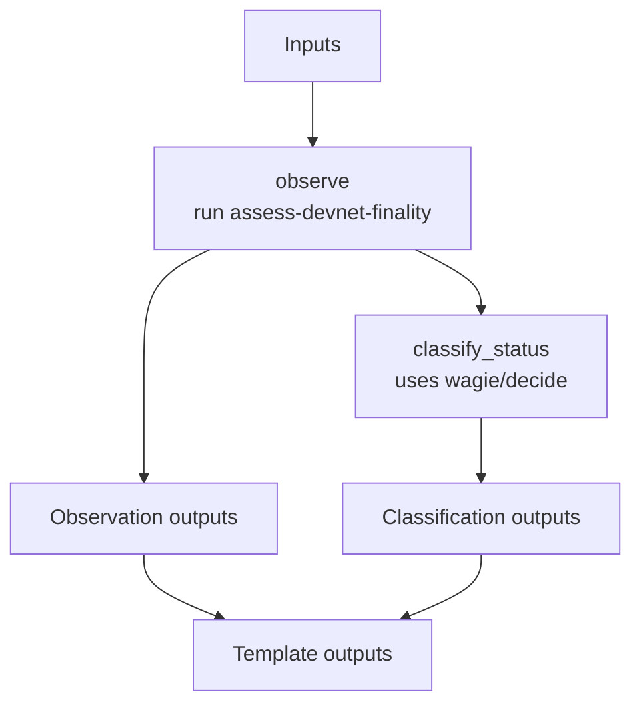

# ethpandaops/devnet-finality-assessment

## Purpose

Focused finality drill-down for a devnet that already looks unhealthy. It gathers finality checkpoints and recent epoch participation, then classifies the current finality state.

## Key Inputs

- `network_name`, `investigation_timeframe`
- `threshold_epochs`
- `instances`
- `data_profile`
- `context_summary`
- `notes_summary`, `notes_highlights`

## Key Outputs

- `finality_status`, `finality_status_confidence`, `finality_status_reasoning`
- `finality_summary`
- `epochs_behind`, `finality_broke_epoch`, `participation_trend`
- `evidence`
- `finality_checkpoints`, `participation_by_epoch`
- `report`

## Flow

## Notes

- This template assumes baseline work already happened and does not try to replace fork and general health analysis.
- The classification step consumes the observed epoch lag, trend, checkpoints, and evidence to label finality as `healthy`, `delayed`, `stalled`, `split-driven`, or `unknown`.
