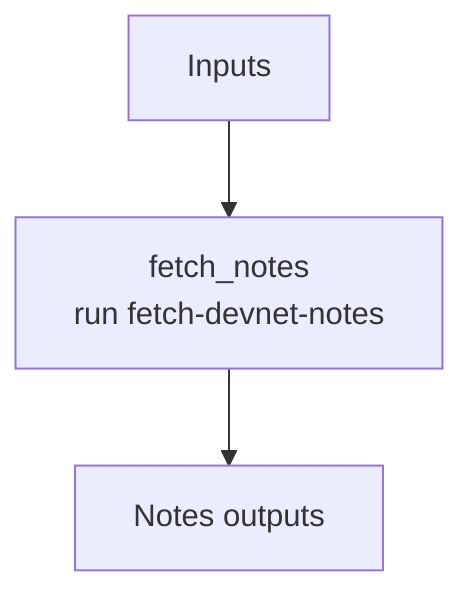

# ethpandaops/devnet-notes

## Purpose

Resolves the canonical operator notes for a devnet and extracts only the details that materially help debugging, reproduction, and fork-boundary interpretation.

## Key Inputs

- `network`: target devnet name
- `notes_url`: optional explicit notes URL

## Key Outputs

- `notes_url`
- `notes_summary`
- `highlights`
- `assumptions`

## Flow

## Notes

- The output is designed to feed context-heavy downstream templates without forcing them to re-fetch notes.
- Highlights should carry reusable facts; assumptions should isolate caveats or stale-looking guidance.
