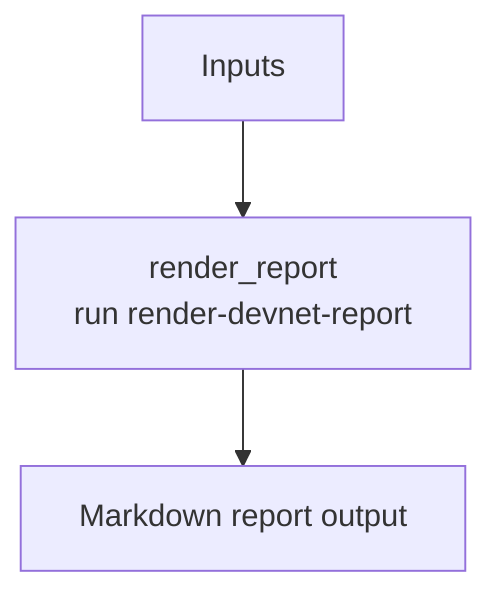

# ethpandaops/devnet-report

## Purpose

Renders a compact, shareable Markdown report from structured devnet outputs. It is a presentation template, not an investigation template.

## Key Inputs

- `network_name`, `investigation_timeframe`
- `problem_statement`
- `context_summary`
- `issue_type`, `root_cause`, `severity`
- `baseline_summary`, `findings_summary`
- `affected_instances`, `evidence`, `instance_reports`, `log_examples`
- `recommended_actions`

## Key Outputs

- `report`

## Flow

## Notes

- This template expects the investigation to have already happened.
- Empty sections are meant to be skipped rather than padded.
