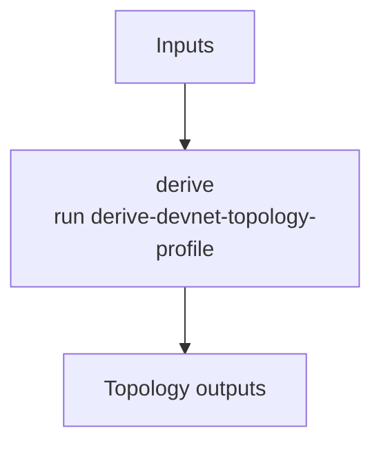

# ethpandaops/devnet-topology-profile

## Purpose

Derives the smallest representative participant topology needed to preserve relevant devnet behavior for config generation.

## Key Inputs

- `devnet_name`
- `goal`
- `client_type`, `image_hint`
- `client_pairs`
- `constraints`
- `notes_summary`, `notes_highlights`, `notes_assumptions`

## Key Outputs

- `profile_summary`
- `assumptions`
- `effective_client_pairs`
- `fallback_pair_added`

## Flow

## Notes

- Explicit `client_pairs` override inferred topology.
- The output is intentionally config-oriented, not a full operational network description.
