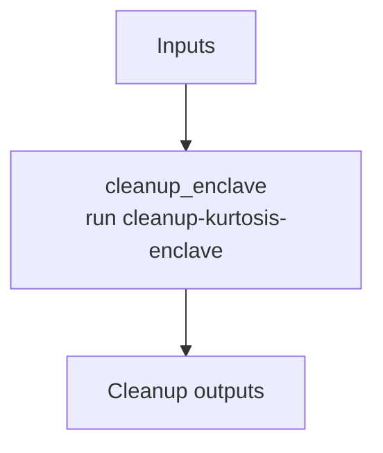

# ethpandaops/kurtosis-enclave-cleanup

## Purpose

Removes a Kurtosis enclave and returns a minimal cleanup result.

## Key Inputs

- `enclave_name`
- `force`

## Key Outputs

- `removed`
- `summary`

## Flow

## Notes

- This is a thin operational wrapper with no downstream branching.
