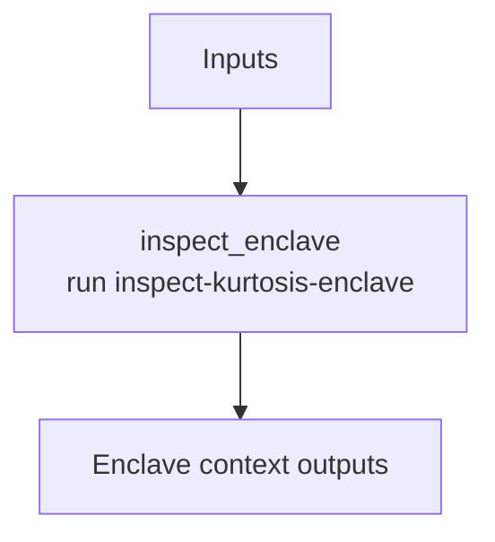

# ethpandaops/kurtosis-enclave-context

## Purpose

Normalizes Kurtosis enclave state into a small operator-facing context: service health, endpoints, and suggested next commands.

## Key Inputs

- `enclave_name`
- `focus`
- `service_name`
- `include_logs`

## Key Outputs

- `status_summary`
- `service_names`
- `public_endpoints`
- `suggested_next_commands`

## Flow

## Notes

- `include_logs` is a targeted inspection hint, not a request for broad log scraping.
