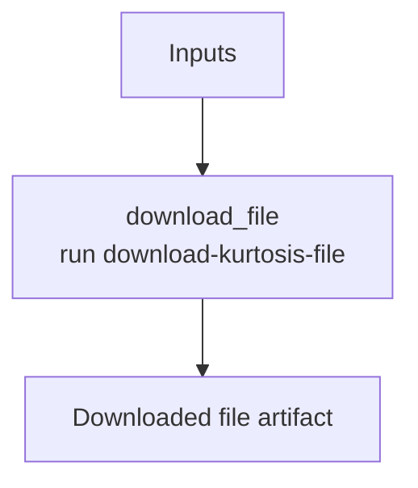

# ethpandaops/kurtosis-enclave-file-download

## Purpose

Downloads a named file from a Kurtosis enclave and returns it as an artifact.

## Key Inputs

- `enclave_name`
- `file_name`

## Key Outputs

- `file`
- `summary`

## Flow

## Notes

- This template now explicitly maps the `file` artifact through the task output contract.
