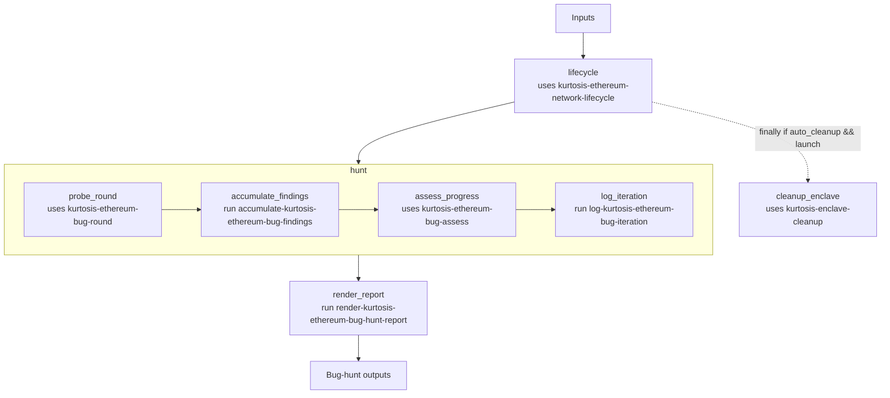

# ethpandaops/kurtosis-ethereum-bug-hunt

## Purpose

Launches or inspects a Kurtosis Ethereum enclave, then runs an iterative bug-hunt loop that accumulates findings and remaining gaps until the hunt converges or further probing has diminishing value.

## Key Inputs

- `goal`, `enclave_name`, `hunt_focus`
- `constraints`, `example_hint`
- `package_ref`, `config_mode`
- `devnet_name`, `client_type`, `image_hint`, `client_pairs`
- `max_iterations`, `launch`, `auto_cleanup`

## Key Outputs

- `resolved_network_name`, `resolved_network_group`
- `config`
- `effective_client_pairs`, `fallback_pair_added`
- `launch_summary`
- `report`, `findings`, `remaining_gaps`, `summary`
- `recommended_actions`
- `completeness`, `information_gain`
- `converged`, `iterations_used`, `iteration_log`

## Flow

## Notes

- `lifecycle` stays outside the loop so enclave setup and session ownership happen once.
- The loop carries typed `findings` and `gaps`, plus a compact `iteration_log`.
- Final report rendering happens once after convergence rather than appending markdown every round.
