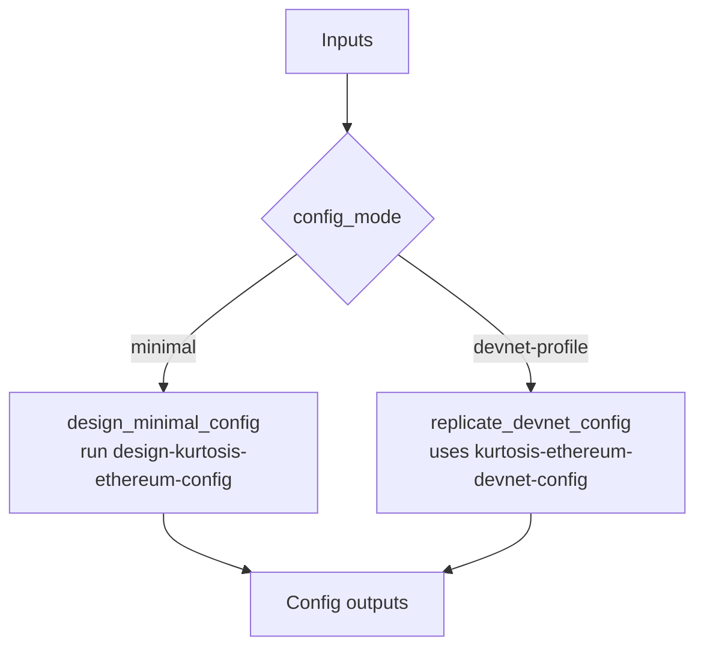

# ethpandaops/kurtosis-ethereum-config

## Purpose

Produces a Kurtosis `network_params.yaml` either by designing a minimal configuration or by deriving one from an existing devnet profile.

## Key Inputs

- `goal`
- `constraints`, `example_hint`
- `package_ref`
- `config_mode`
- `devnet_name`
- `client_type`, `image_hint`, `client_pairs`

## Key Outputs

- `resolved_network_name`, `resolved_network_group`
- `config`
- `config_summary`
- `inferred_features`
- `effective_client_pairs`, `fallback_pair_added`
- `devnet_assumptions`

## Flow

## Notes

- Minimal mode must still return at least two effective client pairs.
- Devnet-profile mode delegates the heavy lifting to `kurtosis-ethereum-devnet-config`.
