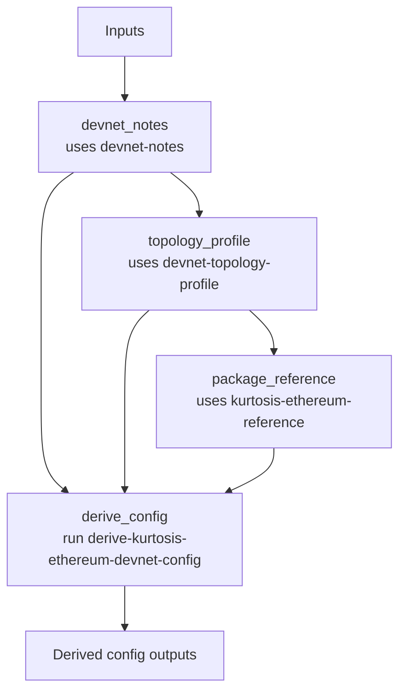

# ethpandaops/kurtosis-ethereum-devnet-config

## Purpose

Builds a Kurtosis ethereum-package config from devnet notes and a reduced topology profile rather than from live devnet health data.

## Key Inputs

- `devnet_name`
- `goal`
- `client_type`, `image_hint`, `client_pairs`
- `constraints`
- `package_ref`

## Key Outputs

- `resolved_network_name`, `resolved_network_group`
- `config`
- `config_summary`
- `assumptions`
- `effective_client_pairs`
- `fallback_pair_added`

## Flow

## Notes

- This template is profile-driven, not observability-driven.
- The `config` artifact is now explicitly mapped through the task output contract.
