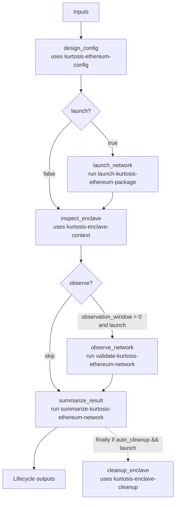

# ethpandaops/kurtosis-ethereum-network-lifecycle

## Purpose

Owns the full Kurtosis Ethereum network lifecycle in one session: config design, optional launch, enclave inspection, optional observation, summary, and optional cleanup.

## Key Inputs

- `goal`, `enclave_name`
- `constraints`, `example_hint`
- `package_ref`, `config_mode`
- `observation_window`, `success_criteria`
- `devnet_name`, `client_type`, `image_hint`, `client_pairs`
- `launch`, `auto_cleanup`

## Key Outputs

- `resolved_network_name`, `resolved_network_group`
- `config`, `config_summary`, `inferred_features`, `devnet_assumptions`
- `effective_client_pairs`, `fallback_pair_added`
- `launch_summary`, `run_command`, `args_file_path`
- `status_summary`, `service_names`, `public_endpoints`, `suggested_next_commands`
- `stable`, `validation_summary`, `observation_summary`
- `finalized_epoch`, `head_epoch`, `participation_rate`
- `proposed_blocks`, `missed_proposals`, `missed_attestations`
- `observation_evidence`, `recommended_actions`
- `summary`

## Flow

## Notes

- Inspection always runs, even when launch is skipped, so the template can summarize an existing enclave.
- Observation only runs when launch is enabled and the observation window is non-zero.
