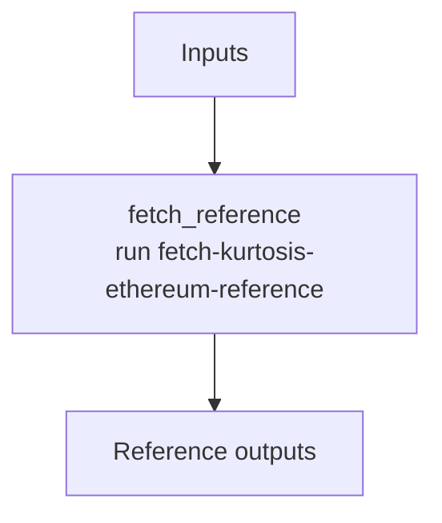

# ethpandaops/kurtosis-ethereum-reference

## Purpose

Fetches narrowly scoped ethereum-package reference material for Kurtosis workflows.

## Key Inputs

- `section`
- `query`
- `package_ref`

## Key Outputs

- `reference`
- `reference_summary`
- `extracted_items`

## Flow

## Notes

- `query` only matters for sections that require a search term or example name.
- The `reference` artifact is now explicitly mapped through the task output contract.
